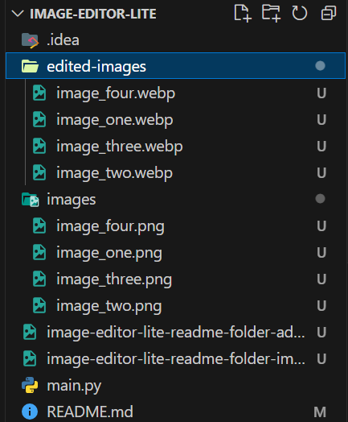
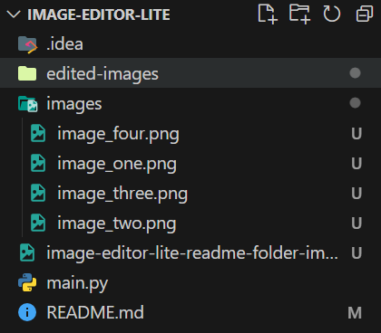

<h1 align=center> Image-Editor-Lite </h1>

<h3 align=center> A python program that edits the format and size of image </h3>

## Usage instructions

- Clone this repository / Download main.py file
- Create folders **'images'** and **'edited-images'** inside the same directory as the main.py file.

- Add the images that need to be resized to the 'images' folder

- Run the program using the command `python main.py` or `python3 main.py`

- The images provided will be resized to 500x500 and converted to webp format and saved in the 'edited-images' folder

## This is what happens

| **Original image** | **➡** | **Edited image** |
| ---------------------- | ---------------------- |
|  | ➡ |  |

### Personally, 

This was used for <a href="duckmath.org">duckmath.org</a> as I needed to switch from bad compression images like pngs and jpg to webp
